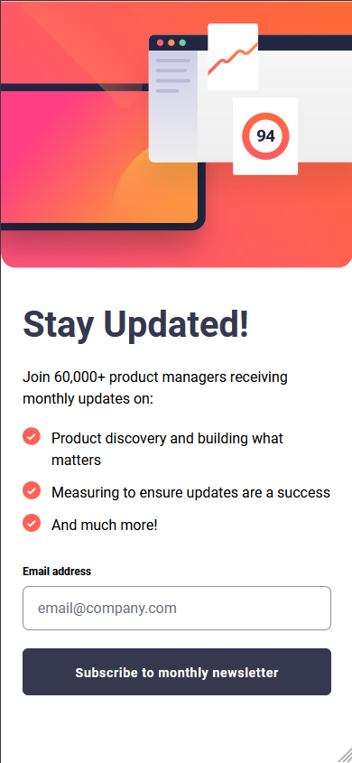

# Frontend Mentor - Newsletter sign-up form with success message solution

This is a solution to the [Newsletter sign-up form with success message challenge on Frontend Mentor](https://www.frontendmentor.io/challenges/newsletter-signup-form-with-success-message-3FC1AZbNrv). Frontend Mentor challenges help you improve your coding skills by building realistic projects.

## Table of contents

- [Frontend Mentor - Newsletter sign-up form with success message solution](#frontend-mentor---newsletter-sign-up-form-with-success-message-solution)
  - [Table of contents](#table-of-contents)
  - [Overview](#overview)
    - [The challenge](#the-challenge)
    - [Screenshot](#screenshot)
    - [Links](#links)
  - [My process](#my-process)
    - [Built with](#built-with)
  - [Author](#author)

**Note: Delete this note and update the table of contents based on what sections you keep.**

## Overview

### The challenge

Users should be able to:

- Add their email and submit the form
- See a success message with their email after successfully submitting the form
- See form validation messages if:
  - The field is left empty
  - The email address is not formatted correctly
- View the optimal layout for the interface depending on their device's screen size
- See hover and focus states for all interactive elements on the page

### Screenshot

| Desktop                              | Mobile                             |
| ------------------------------------ | ---------------------------------- |
|  |  |

### Links

- Solution URL: <https://github.com/Myoschen/frontend-mentor-solutions/tree/main/solutions/newsletter-sign-up-with-success-message>
- Live Site URL: <https://frontend-mentor-solutions-chi.vercel.app>

## My process

### Built with

- [React](https://react.dev/)
- [Tailwind CSS](https://tailwindcss.com/)
- [React Hook Form](https://www.react-hook-form.com/)
- [Valibot](https://valibot.dev/)
- [clsx](https://github.com/lukeed/clsx)
- [tailwind-merge](https://github.com/dcastil/tailwind-merge)

## Author

- Website - [Myoschen](https://github.com/Myoschen)
- Frontend Mentor - [@Myoschen](https://www.frontendmentor.io/profile/Myoschen)
- Twitter - [@MyosChen](https://www.twitter.com/MyosChen)
