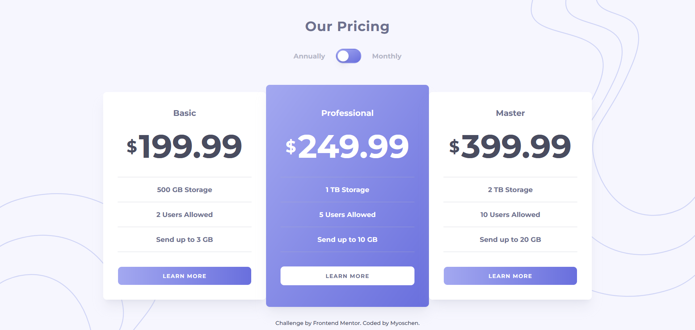

# Frontend Mentor - Pricing component with toggle solution

This is a solution to the [Pricing component with toggle challenge on Frontend Mentor](https://www.frontendmentor.io/challenges/pricing-component-with-toggle-8vPwRMIC). Frontend Mentor challenges help you improve your coding skills by building realistic projects.

## Table of contents

- [Frontend Mentor - Pricing component with toggle solution](#frontend-mentor---pricing-component-with-toggle-solution)
  - [Table of contents](#table-of-contents)
  - [Overview](#overview)
    - [The challenge](#the-challenge)
    - [Screenshot](#screenshot)
    - [Links](#links)
  - [My process](#my-process)
    - [Built with](#built-with)
  - [Author](#author)

**Note: Delete this note and update the table of contents based on what sections you keep.**

## Overview

### The challenge

Users should be able to:

- View the optimal layout for the component depending on their device's screen size
- Control the toggle with both their mouse/trackpad and their keyboard
- **Bonus**: Complete the challenge with just HTML and CSS

### Screenshot

| Desktop                              | Mobile                             |
| ------------------------------------ | ---------------------------------- |
|  |  |

### Links

- Solution URL: <https://github.com/Myoschen/frontend-mentor-solutions/tree/main/solutions/pricing-component-with-toggle>
- Live Site URL: <https://frontend-mentor-solutions-zk1e-8dolcrh3s-myoschen.vercel.app/>

## My process

### Built with

- [React](https://react.dev/)
- [shadcn/ui](https://ui.shadcn.com/) - Switch component
- [Tailwind CSS](https://tailwindcss.com/)
- [clsx](https://github.com/lukeed/clsx)
- [tailwind-merge](https://github.com/dcastil/tailwind-merge)
- [Fontsource](https://fontsource.org/) - Montserrat font

## Author

- Website - [Myoschen](https://github.com/Myoschen)
- Frontend Mentor - [@Myoschen](https://www.frontendmentor.io/profile/Myoschen)
- Twitter - [@MyosChen](https://www.twitter.com/MyosChen)
